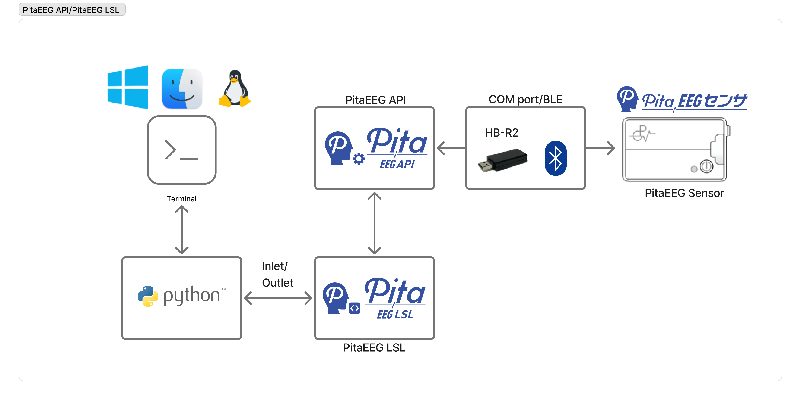

# PitaEEGLSL

[](https://badge.fury.io/py/pitaeeg)
[](https://www.python.org/downloads/)
[](https://opensource.org/licenses/MIT)
[](https://github.com/pgv-inc/PitaEEGLSL/actions/workflows/docs.yml)
[](https://github.com/pgv-inc/PitaEEGLSL/actions/workflows/github-code-scanning/codeql)
[](https://github.com/pgv-inc/PitaEEGLSL/actions/workflows/pythonpackage.yml)

[](https://qlty.sh/gh/pgv-inc/projects/PitaEEGLSL)
[](https://qlty.sh/gh/pgv-inc/projects/PitaEEGLSL)
[](https://codecov.io/gh/pgv-inc/PitaEEGLSL)

---

## 医療機器ではないことの免責事項（重要）

本ソフトウェアおよび関連するPitaEEGセンサーは **医療機器ではありません**。

- 本パッケージは、**疾患や医学的状態の診断、治療、予防、緩和を目的としたものではありません**。
- 本ソフトウェアを使用して得られた結果は、**臨床的意思決定に使用してはなりません**。
- 臨床ワークフロー、患者診断、または規制された医療環境での使用は **明示的に推奨されません**。
- 本ソフトウェアは、**研究、評価、教育、プロトタイピング目的のみ**を対象としています。

ユーザーは、本ソフトウェアの使用が適用される法律、規制、および機関審査要件に準拠していることを確認する責任があります。

---

## システムアーキテクチャ



**データフロー:**

```text
PitaEEG Sensor
   ↓
PitaEEG API (C/C++)
   ↓
Python wrapper (pitaeeg)
   ↓
LabStreamingLayer (LSL)
   ↓
Downstream tools (LabRecorder, MNE, custom pipelines)
```

---

## 要件

- Python > 3.11, < 4.0
- make >= 4.3
- Poetry >= 2.1（開発用）

---

## インストール

### PyPIから（推奨）

```bash
pip install pitaeeg
```

### GitHubから

#### Poetry

```toml
pitaeeg = { git = "https://github.com/pgv-inc/PitaEEGLSL.git", rev = "0.12.0" }
```

```bash
poetry install
```

#### pip

```bash
pip install git+https://github.com/pgv-inc/PitaEEGLSL.git@0.12.0
```

---

## ネイティブライブラリのセットアップ

> **重要**: ネイティブAPIライブラリはプロプライエタリであり、ライセンスが必要です。

ネイティブライブラリを取得したら、`libs/`ディレクトリの下に配置してください：

```text
libs/
├── linux/
│   └── libpitaeeg.so
├── macos/
│   ├── arm64/
│   │   └── libpitaeeg.dylib
│   └── x86_64/
│       └── libpitaeeg.dylib
└── windows/
    └── pitaeeg.dll
```

ライブラリは検出されたプラットフォームに基づいて自動的に読み込まれます。

---

## クイックスタート

```python
from pitaeeg import Sensor

with Sensor(port="COM3") as sensor:
    sensor.connect("HARU2-001", scan_timeout=10.0)
    sensor.start_measurement()

    for data in sensor.receive_data():
        print(data.data)
        break
```

---

## 使用例

### 利用可能なデバイスのスキャン

```python
from pitaeeg import Sensor

with Sensor(port="COM3") as sensor:
    devices = sensor.scan_devices(timeout=10.0)
    for device in devices:
        print(f"{device['name']} ({device['id']})")
```

### データをCSVに保存

```bash
python examples/wireless_acquisition.py COM3 HARU2-001 --out output.csv
```

---

## API概要

### Sensor

#### コンストラクタ

```python
Sensor(
    port: str,
    library_path: str | None = None,
    com_timeout: int = 2000,
    scan_timeout: int = 5000,
)
```

#### コアメソッド

- `scan_devices(timeout=10.0)`
- `connect(device_name, scan_timeout=10.0)`
- `start_measurement(enabled_channels=None)`
- `receive_data()`
- `stop_measurement()`
- `disconnect()`
- `close()`

#### プロパティ

- `is_connected`
- `is_measuring`

---

## エラーハンドリング

すべての例外は`PitaEEGSensorError`を継承します：

- `LibraryNotFoundError`
- `InitializationError`
- `ScanError`
- `SensorConnectionError`
- `MeasurementError`

---

## 開発

このプロジェクトは、モダンなPython OSSのベストプラクティスに従っています：

- 静的型付け（`mypy`）
- 自動リントとフォーマット（`ruff`）
- GitHub ActionsによるCI
- カバレッジ追跡

### セットアップ

```bash
make precommit-install
```

### チェックの実行

```bash
make check
```

### テストの実行

```bash
make pytest
```

---

## 貢献

貢献を歓迎します。  
プルリクエストを提出する前に、[CONTRIBUTING.md](.github/CONTRIBUTING.md)をお読みください。

---

## ライセンス

MIT License  
詳細は[LICENSE](LICENSE)を参照してください。

---

## セキュリティ

セキュリティ関連の問題については、[SECURITY.md](SECURITY.md)を参照してください。

---

## 設計思想：なぜLabStreamingLayer（LSL）なのか？

PitaEEGLSLは、独自のストリーミングやファイルベースのインターフェースを提供するのではなく、**LabStreamingLayer（LSL）**を中心に意図的に設計されています。

その理由は以下の通りです：

### なぜLSLなのか？

LSLは、リアルタイムデータ同期のための神経科学および心理生理学研究における **事実上の標準** となっています。  
LSLを採用することで、PitaEEGLSLは以下を可能にします：

- **時間同期されたマルチモーダル実験**  
  EEGデータを行動タスク、視線追跡、モーションキャプチャ、または生理学的信号と整列させることができます。
- **既存ツールとの相互運用性**  
  LabRecorder、MNE、EEGLAB、BCILAB、およびカスタムLSLベースのパイプラインと互換性があります。
- **再現可能な研究ワークフロー**  
  取得、記録、分析の分離により、実験の透明性が向上します。
- **低遅延、リアルタイムストリーミング**  
  ニューロフィードバック、オンライン分析、クローズドループ実験に適しています。

### 設計原則

- **薄いPythonラッパー**  
  Pythonレイヤーは、ネイティブAPIまたはLSLによって既に処理されているロジックの重複を意図的に回避します。
- **明示的なライフサイクル管理**  
  コンテキストマネージャーにより、確定的なリソースクリーンアップが保証されます。
- **研究第一のエルゴノミクス**  
  APIは、便利なショートカットよりも明確さと堅牢性を優先します。

この設計により、PitaEEGLSLは並行する非互換ワークフローを作成するのではなく、既存のLSLベースの研究エコシステムに自然に統合できます。

---

## 学術利用と引用

**PitaEEGLSL**または**PitaEEGセンサー**を学術研究で使用する場合は、ソフトウェアとハードウェアを適切に引用してください。

### ソフトウェアの引用

```bibtex
@software{pitaeeglsl,
  title        = {PitaEEGLSL: Python interface for PitaEEG and LabStreamingLayer},
  author       = {{PGV Inc.}},
  year         = {2025},
  url          = {https://github.com/pgv-inc/PitaEEGLSL}
}
```

### ハードウェアの参照

実験装置を説明する際は、PGV Inc.が提供するPitaEEGハードウェアドキュメントを参照してください。

本ソフトウェアを使用して公開した研究については、GitHub Discussionsを通じて公開物へのリンクを歓迎します。

---

## よくある質問（FAQ）

### Q1. PitaEEGハードウェアなしでこのパッケージを使用できますか？

いいえ。  
このパッケージには、**PitaEEGセンサーハードウェアとライセンス付きネイティブAPIライブラリの両方**が必要です。

---

### Q2. LabStreamingLayer（LSL）なしでこれを使用できますか？

LSLは、このパッケージのコア設計前提です。  
Python APIは生データオブジェクトを公開しますが、意図された使用法は **LSLベースのストリーミング** です。

---

### Q3. このパッケージは臨床または診断用途に適していますか？

いいえ。  
本ソフトウェアは **研究および開発目的のみ** を対象としており、**医療機器またはSaMDとして認定されていません**。

---

### Q4. このパッケージはオフラインデータ分析をサポートしていますか？

データ記録は、通常 **LabRecorder** またはその他のLSL互換ツールで処理されます。  
オフライン分析は、外部ツールチェーン（例：MNE、EEGLAB）を使用して記録されたデータに対して実行する必要があります。

---

### Q5. バグの報告や質問はどこで行えばよいですか？

- バグレポート: GitHub Issues  
- 使用に関する質問: GitHub Discussions  

問題を報告する際は、OS、Pythonバージョン、ハードウェアモデルを含めてください。

---

## 本ライブラリについて

**PitaEEGLSL** は、PitaEEG 脳波センサーから取得したデータを  
**LabStreamingLayer（LSL）** を用いてリアルタイム配信するための Python ライブラリです。

研究用途・開発用途において、以下を目的としています。

- 脳波データのリアルタイム取得
- LSL を用いた他モダリティとの時間同期
- 既存の神経科学ツールチェーンとの統合

### 利用対象者

- LSL を用いた実験を行う研究者
- PitaEEG センサーを Python から制御したい開発者
- EEG を用いたリアルタイム解析・可視化・ML パイプライン構築者

### 重要な注意事項

本ライブラリは **Python ラッパー部分のみ** を提供します。  
以下は別途必要となります。

- PitaEEG Sensor（ハードウェア）
- PitaEEG API（ライセンス提供）

これらがない場合、本ライブラリは動作しません。

### 研究用途について

- 本ソフトウェアは **医療機器ではありません**
- 診断・治療目的での使用は想定していません
- 研究・評価・プロトタイピング用途に限定されます

---

## English Version

For English version, please see [README.md](README.md).

